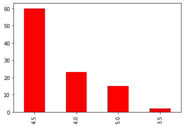
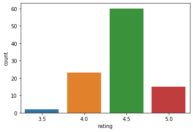
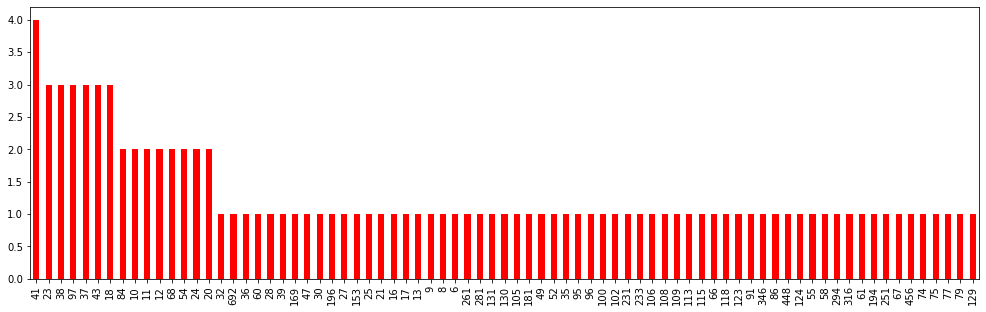

# Yelp


## Documentation: https://www.yelp.com/developers/documentation/v3/authentication

### Client ID
RsrUSB_o5o9q1Y91jGRt8g

### API Key
1GuEZTGk6H6bzI8Z8IMPifQNOZ6s_pxx2XI3hPGdXIKCrKsmt7_MNPVCR4wfq6WeS6ggSiCpWEIO0Ob2KOQ3m-4bM1_CejFLA8pGom5FZ6SeDtMDd0Ulsyr0v9N8X3Yx


```python
import pandas as pd
import requests,json
import matplotlib.pyplot as plt
import seaborn as sns
api_url = "https://api.yelp.com/v3/businesses/search"
api_key = "1GuEZTGk6H6bzI8Z8IMPifQNOZ6s_pxx2XI3hPGdXIKCrKsmt7_MNPVCR4wfq6WeS6ggSiCpWEIO0Ob2KOQ3m-4bM1_CejFLA8pGom5FZ6SeDtMDd0Ulsyr0v9N8X3Yx"
#set up parameter dictionary according to documentation
params = {"term": "bakeries",
         "location": "Pittsburgh",
         "sort_by": "rating",
         "limit": 50}
#set up header dictionary w/ api key according to documentation
headers = {"Authorization": "Bearer {}".format(api_key)}
#call the api
response = requests.get(api_url, params = params, headers = headers)
```


```python
#isolate the JSON data from the response object. These are the different parameters to search by. I.E term: Bakeries
data = response.json()
top_50 = pd.DataFrame(data["businesses"])
print(top_50.dtypes)
```

    id                object
    alias             object
    name              object
    image_url         object
    is_closed           bool
    url               object
    review_count       int64
    categories        object
    rating           float64
    coordinates       object
    transactions      object
    price             object
    location          object
    phone             object
    display_phone     object
    distance         float64
    dtype: object
    


```python
from pandas.io.json import json_normalize
#flatten data and load to data frame, with _separators. This will get us more detail to choose from. i.e. location_zip
top_50 = pd.json_normalize(data["businesses"], sep="_")
print(list(top_50))
print(len(top_50))
```

    ['id', 'alias', 'name', 'image_url', 'is_closed', 'url', 'review_count', 'categories', 'rating', 'transactions', 'price', 'phone', 'display_phone', 'distance', 'coordinates_latitude', 'coordinates_longitude', 'location_address1', 'location_address2', 'location_address3', 'location_city', 'location_zip_code', 'location_country', 'location_state', 'location_display_address']
    50
    


```python
#Sort by the highest rated cafes in the burgh. Print the top 50 and use col name, rating, review_count
print(top_50[["name","rating","review_count"]].sort_values(by=['rating'], ascending = False).head(50))
```

                                              name  rating  review_count
    0                 Five Points Artisan Bakeshop     5.0           123
    38                     Cibrone M & Sons Bakery     5.0            20
    26                                 KaFair Cafe     5.0            17
    19                               Dana's Bakery     5.0            24
    36                                 350° Bakery     5.0            18
    1                               Redhawk Coffee     5.0           153
    4                             Nancy B's Bakery     5.0            75
    31                                 Duck Donuts     4.5            96
    47                             Party Cake Shop     4.5            38
    27                        Flour & Sugar Cakery     4.5            36
    46                           Le Cupcake Shoppe     4.5            24
    28                     Good L'Oven Cookie Shop     4.5            30
    29                  Moio's Italian Pastry Shop     4.5           100
    30                             Treats ‘N Beans     4.5            41
    45                        La Gourmadine Bakery     4.5            23
    42                     Mancini's Bread Company     4.5            41
    33                            Grandview Bakery     4.5           102
    34                                 Good L'oven     4.5            37
    24                            The Speckled Egg     4.5            41
    37                            Mancini's Bakery     4.5            25
    39                          Kretchmar's Bakery     4.5            66
    41                      Great Harvest Bread Co     4.5            43
    32                         Nothing Bundt Cakes     4.5            37
    25              The Butterwood Bake Consortium     4.5           196
    23                          Commonplace Coffee     4.5           194
    11                              Oakmont Bakery     4.5           448
    2          La Gourmandine Bakery & Pastry Shop     4.5           456
    3         Jean-Marc Chatellier's French Bakery     4.5           169
    5                           Colangelo's Bakery     4.5            74
    6                        La Gourmandine Bakery     4.5            67
    7                               Fortuitea Cafe     4.5            91
    8                       Le Petit Cafe & Grille     4.5            61
    9                               Mediterra Cafe     4.5           108
    22                               Sumi's Cakery     4.5            86
    10            Soergel Orchards & Garden Center     4.5           118
    12                 Madeleine Bakery And Bistro     4.5            68
    13                              Cafe Chocolade     4.5            77
    14                                 Waffallonia     4.5           316
    15                           Better-Maid Donut     4.5            68
    16                          Food Glorious Food     4.5            58
    17         La Gourmandine Bakery & Pastry Shop     4.5            95
    18                                  BreadWorks     4.5            38
    20                              Minerva Bakery     4.5            32
    21                       Allegro Hearth Bakery     4.5            79
    35                               Gaby Et Jules     4.0           233
    40                        Pink Box Bakery Cafe     4.0           115
    43  Peace, Love and Little Donuts - Pittsburgh     4.0           281
    44             Sinful Sweets Chocolate Company     4.0           131
    48                        Priory Fine Pastries     4.0            52
    49                               Lola's Eatery     4.0            37
    


```python
#Check the different categories of aliases to choose from
flat_cafes = pd.json_normalize(data["businesses"], sep = "_", record_path="categories")
print(flat_cafes.head(30))
```

                   alias                 title
    0           bakeries              Bakeries
    1           desserts              Desserts
    2             coffee          Coffee & Tea
    3         foodtrucks           Food Trucks
    4           cakeshop  Patisserie/Cake Shop
    5           bakeries              Bakeries
    6           desserts              Desserts
    7           macarons              Macarons
    8           bakeries              Bakeries
    9           bakeries              Bakeries
    10             cafes                 Cafes
    11          bakeries              Bakeries
    12  breakfast_brunch    Breakfast & Brunch
    13          bakeries              Bakeries
    14            coffee          Coffee & Tea
    15             vegan                 Vegan
    16         chocolate  Chocolatiers & Shops
    17  breakfast_brunch    Breakfast & Brunch
    18            coffee          Coffee & Tea
    19             cafes                 Cafes
    20          bakeries              Bakeries
    21           markets      Fruits & Veggies
    22           grocery               Grocery
    23       gluten_free           Gluten-Free
    24          bakeries              Bakeries
    25          cupcakes              Cupcakes
    26            donuts                Donuts
    27          bakeries              Bakeries
    28          bakeries              Bakeries
    29       gluten_free           Gluten-Free
    


```python
#Further normalizing the date within the json file to get more detail such as co-ordinates
flat_cafes = pd.json_normalize(data["businesses"], sep = "_", record_path="categories", meta = ["name", "alias","rating",["coordinates","latitude"],["coordinates","longitude"]],meta_prefix="biz_")
flat_cafes.head(2)

```


<div>
<style scoped>
    .dataframe tbody tr th:only-of-type {
        vertical-align: middle;
    }

    .dataframe tbody tr th {
        vertical-align: top;
    }

    .dataframe thead th {
        text-align: right;
    }
</style>
<table border="1" class="dataframe">
  <thead>
    <tr style="text-align: right;">
      <th></th>
      <th>alias</th>
      <th>title</th>
      <th>biz_name</th>
      <th>biz_alias</th>
      <th>biz_rating</th>
      <th>biz_coordinates_latitude</th>
      <th>biz_coordinates_longitude</th>
    </tr>
  </thead>
  <tbody>
    <tr>
      <th>0</th>
      <td>bakeries</td>
      <td>Bakeries</td>
      <td>Five Points Artisan Bakeshop</td>
      <td>five-points-artisan-bakeshop-pittsburgh</td>
      <td>5</td>
      <td>40.4443</td>
      <td>-79.9168</td>
    </tr>
    <tr>
      <th>1</th>
      <td>desserts</td>
      <td>Desserts</td>
      <td>Five Points Artisan Bakeshop</td>
      <td>five-points-artisan-bakeshop-pittsburgh</td>
      <td>5</td>
      <td>40.4443</td>
      <td>-79.9168</td>
    </tr>
  </tbody>
</table>
</div>


```python
#set up parameter dictionary according to documentation to start at record number 50 and append to the top 50 data. 
params = {"term": "bakeries",
         "location": "Pittsburgh",
         "sort_by": "rating",
         "limit": 50,
         "offset": 50}

#call the api
result = requests.get(api_url, params = params, headers = headers)
next_50 = pd.json_normalize(result.json()["businesses"])

#append the results, setting ignore index to renumber rows
top_100 = top_50.append(next_50, ignore_index = True)

#print the bottom 10 rated cafes in pittsburgh
print(top_100[["name","rating","review_count"]].sort_values(by=['rating'], ascending = False).tail(10))
print(top_100.shape)
```

                                              name  rating  review_count
    74                             Prantl's Bakery     4.0           251
    73                             Gluuteny Bakery     4.0           106
    72                       Chateau Café & Coffee     4.0            54
    43  Peace, Love and Little Donuts - Pittsburgh     4.0           281
    69                  Everyday's A Sunday & Cafe     4.0            54
    66                               Pigeon Bagels     4.0            84
    64                         The Enrico Biscotti     4.0           181
    99                              Potomac Bakery     4.0            23
    91                             Prantl's Bakery     3.5            97
    98                 Bartram House Bakery & Cafe     3.5           113
    (100, 34)
    


```python
top_100.rating.value_counts().plot(kind = 'bar', color = 'red')
```


    <matplotlib.axes._subplots.AxesSubplot at 0x2c8ec7ba430>





```python
sns.countplot(x = 'rating', data = top_100)
```


    <matplotlib.axes._subplots.AxesSubplot at 0x2c8ecf11790>





```python
reviews = top_100.review_count
plt.plot(reviews)
```


    [<matplotlib.lines.Line2D at 0x2c8ecfb1e80>]


```python
#Does getting good reviews relate to the number of reviews??
top_100.review_count.value_counts().plot(kind = 'bar', color = 'red', figsize =(17,5))
```


    <matplotlib.axes._subplots.AxesSubplot at 0x2c8ecfee2b0>




